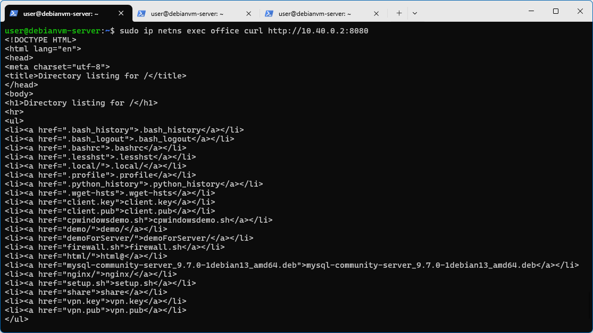
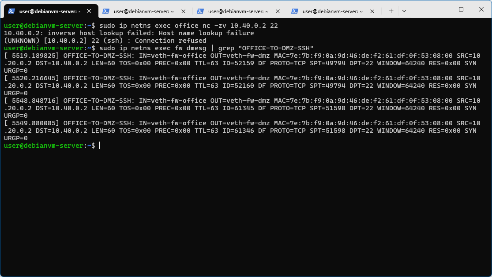
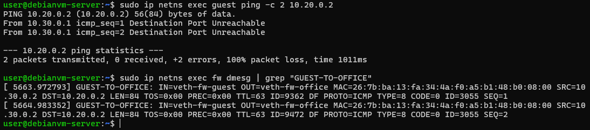
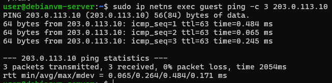
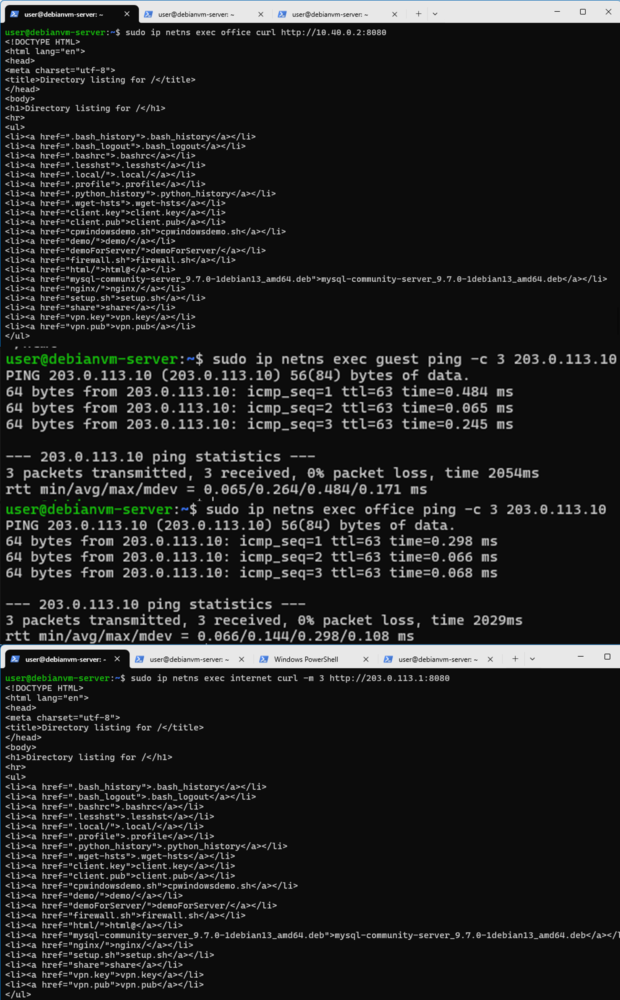
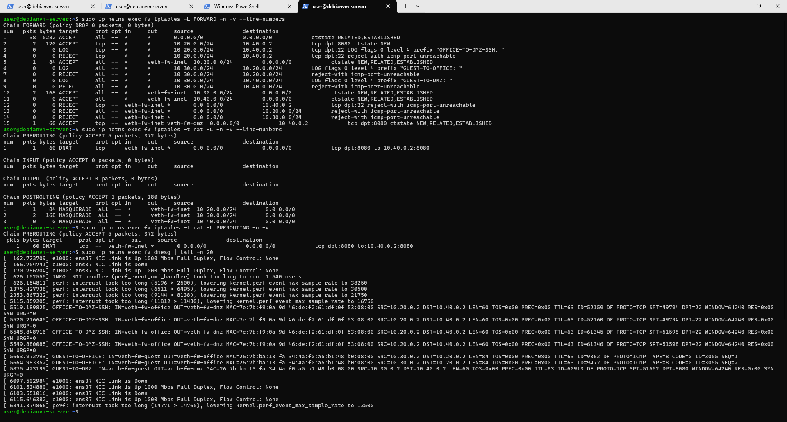
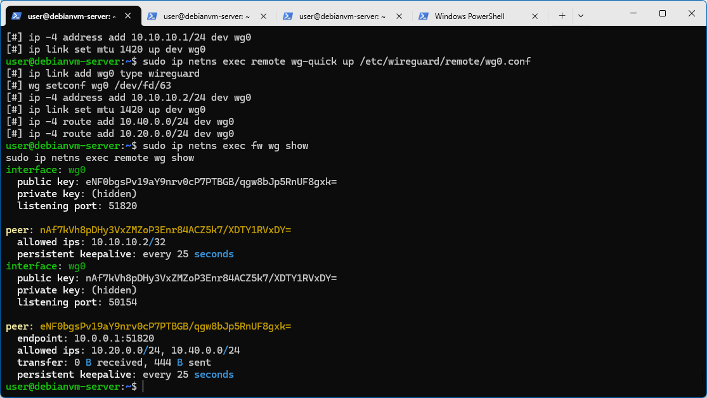

# 企业级网络安全架构搭建与攻防演练

## 一、实验环境
- 操作系统：Linux debianvm-server 6.12.74+deb13+1-amd64 #1 SMP PREEMPT_DYNAMIC Debian 6.12.74-2 (2026-03-08) x86_64 GNU/Linux
- WireGuard版本：wireguard-tools v1.0.20210914 - https://git.zx2c4.com/wireguard-tools/
- iptables版本：iptables v1.8.11 (nf_tables)

## 二、拓扑图和地址规划
（手绘或工具绘制的拓扑图）
（地址规划表）
### 地址规划表
| 区域 | 网段 | fw侧地址 | 主机地址 | 说明 |
|---|---|---|---|---|
| office | 10.20.0.0/24 | 10.20.0.1 | 10.20.0.2 | 办公网 |
| guest | 10.30.0.0/24 | 10.30.0.1 | 10.30.0.2 | 访客网 |
| dmz | 10.40.0.0/24 | 10.40.0.1 | 10.40.0.2 | DMZ服务器 |
| internet | 203.0.113.0/24 | 203.0.113.1 | 203.0.113.10 | 外网模拟 |
| vpn | 10.10.10.0/24 | 10.10.10.1 | 10.10.10.2 | VPN远程 |

## 三、第一部分：网络规划与基础搭建
### 脚本说明
根据上表，下面是setup.sh的说明，脚本详见[setup.sh](./setup.sh)
```bash
#!/bin/bash

set -e  # 遇到任何错误立即退出，避免“半搭建成功”的脏环境

echo "[1] 清理旧环境..."

# 删除已有 namespace（如果存在就删除，避免重复创建报错）
for ns in fw office guest dmz internet remote; do
    sudo ip netns del $ns 2>/dev/null || true
    # 2>/dev/null：隐藏错误输出
    # || true：即使删除失败也不终止脚本
done

echo "[2] 创建 namespaces..."

# 创建所有网络命名空间（模拟不同网络区域）
for ns in fw office guest dmz internet remote; do
    sudo ip netns add $ns
done

echo "[3] 创建 veth 对（虚拟网线）..."

# ---------------- OFFICE ----------------
# 创建一对虚拟网卡（类似一根网线两端）
sudo ip link add veth-fw-office type veth peer name veth-office

# 一端放入防火墙namespace
sudo ip link set veth-fw-office netns fw

# 另一端放入office网络
sudo ip link set veth-office netns office

# ----------------GUEST----------------
sudo ip link add veth-fw-guest type veth peer name veth-guest
sudo ip link set veth-fw-guest netns fw
sudo ip link set veth-guest netns guest

# ----------------DMZ----------------
sudo ip link add veth-fw-dmz type veth peer name veth-dmz
sudo ip link set veth-fw-dmz netns fw
sudo ip link set veth-dmz netns dmz

# ----------------INTERNET----------------
sudo ip link add veth-fw-inet type veth peer name veth-inet
sudo ip link set veth-fw-inet netns fw
sudo ip link set veth-inet netns internet

# ----------------VPN REMOTE----------------
sudo ip link add veth-fw-vpn type veth peer name veth-vpn
sudo ip link set veth-fw-vpn netns fw
sudo ip link set veth-vpn netns remote

echo "[4] 配置 IP 地址..."

# ---------------- fw（核心路由器/防火墙）----------------
# fw作为中心节点，需要连接所有子网
sudo ip netns exec fw ip addr add 10.20.0.1/24 dev veth-fw-office   # office网关地址
sudo ip netns exec fw ip addr add 10.30.0.1/24 dev veth-fw-guest    # guest网关地址
sudo ip netns exec fw ip addr add 10.40.0.1/24 dev veth-fw-dmz  # dmz网关地址
sudo ip netns exec fw ip addr add 203.0.113.1/24 dev veth-fw-inet   # 外网接口（模拟Internet）
sudo ip netns exec fw ip addr add 10.10.10.1/24 dev veth-fw-vpn # VPN隧道网关

# ---------------- office 主机 ----------------
sudo ip netns exec office ip addr add 10.20.0.2/24 dev veth-office

# ---------------- guest 主机 ----------------
sudo ip netns exec guest ip addr add 10.30.0.2/24 dev veth-guest

# ---------------- dmz 服务器 ----------------
sudo ip netns exec dmz ip addr add 10.40.0.2/24 dev veth-dmz

# ---------------- internet 外网主机 ----------------
sudo ip netns exec internet ip addr add 203.0.113.10/24 dev veth-inet

# ---------------- remote 远程员工 ----------------
sudo ip netns exec remote ip addr add 10.10.10.2/24 dev veth-vpn

echo "[5] 启动所有网络接口..."

for ns in fw office guest dmz internet remote; do
    sudo ip netns exec $ns ip link set lo up
done    # 启动回环接口

sudo ip netns exec office ip link set veth-office up    # 启动office网络接口
sudo ip netns exec guest ip link set veth-guest up  # 启动guest网络接口
sudo ip netns exec dmz ip link set veth-dmz up  # 启动dmz网络接口
sudo ip netns exec internet ip link set veth-inet up    # 启动internet网络接口
sudo ip netns exec remote ip link set veth-vpn up   # 启动remote网络接口

sudo ip netns exec fw ip link set veth-fw-office up # 启动fw到veth-fw-office的接口
sudo ip netns exec fw ip link set veth-fw-guest up  # 启动fw到veth-fw-guest的接口
sudo ip netns exec fw ip link set veth-fw-dmz up    # 启动fw到veth-fw-dmz的接口
sudo ip netns exec fw ip link set veth-fw-inet up   # 启动fw到veth-fw-inet的接口
sudo ip netns exec fw ip link set veth-fw-vpn up    # 启动fw到veth-fw-vpn的接口

echo "[6] 配置默认路由..."

# 所有主机默认流量都必须经过fw
sudo ip netns exec office ip route add default via 10.20.0.1
sudo ip netns exec guest ip route add default via 10.30.0.1
sudo ip netns exec dmz ip route add default via 10.40.0.1
sudo ip netns exec internet ip route add default via 203.0.113.1
sudo ip netns exec remote ip route add default via 10.10.10.1

echo "[7] 开启防火墙 IP 转发功能..."

# fw变成“路由器”，必须开启转发，否则不同网段无法通信
sudo ip netns exec fw sysctl -w net.ipv4.ip_forward=1

echo "网络拓扑基础搭建完成"
```
### 连通性测试
通过执行上面的bash脚本后分别进行连通性测试并检查各接口状态，可以看到下面的输出。


### 拓扑搭建说明
#### 1. 拓扑搭建步骤
本实验采用Linux network namespace构建虚拟企业网络环境，整体步骤如下：

##### （1）创建网络隔离环境
首先创建六个network namespace，分别模拟企业中的不同网络区域：
* fw（防火墙/核心网关）
* office（办公网）
* guest（访客网）
* dmz（对外服务区）
* internet（外部网络）
* remote（远程用户）

各namespace之间默认相互隔离。

##### （2）构建二层链路（veth）
使用 veth pair 虚拟网卡对连接各子网与防火墙 fw：
* office <-> fw
* guest <-> fw
* dmz <-> fw
* internet <-> fw
* remote <-> fw

每一对 veth 相当于一根“虚拟网线”，用于模拟真实物理链路。

##### （3）配置IP地址
为每个接口分配对应网段IP地址：
* office：10.20.0.0/24
* guest：10.30.0.0/24
* dmz：10.40.0.0/24
* internet：203.0.113.0/24
* vpn：10.10.10.0/24

fw在每个网段中分别配置对应网关地址（.1），各主机使用 .2 或指定地址。

##### （4）配置路由关系
各子网主机默认网关统一指向fw：
* office -> 10.20.0.1
* guest -> 10.30.0.1
* dmz -> 10.40.0.1
* internet -> 203.0.113.1
* remote -> 10.10.10.1

同时在 fw 上开启 IP 转发功能，使其具备三层路由能力。

##### （5）启动接口与系统配置
所有network namespace中的loopback接口与veth接口均被启用，确保链路处于UP状态，从而实现正常通信。
#### 2. 验证方法
为验证拓扑搭建的正确性，采用以下测试方式：
##### （1）基础连通性测试
使用 ping 命令测试各子网主机到 fw 的连通性：
* office -> fw（10.20.0.1）
* guest -> fw（10.30.0.1）
* dmz -> fw（10.40.0.1）
* internet -> fw（203.0.113.1）

若均能收到ICMP Reply，说明：
* veth链路建立成功
* IP配置正确
* 接口处于UP状态


##### （2）防火墙节点检查
在 fw 节点执行以下命令验证配置：
* `ip addr`：检查各接口IP是否正确绑定
* `ip link`：检查接口状态是否为UP
* `ip route`：检查路由表是否完整

##### （3）综合验证
通过跨网段ping（如office -> dmz）进一步验证fw的三层转发能力是否正常，为后续NAT、防火墙策略与VPN配置提供基础。

## 四、第二部分：防火墙策略实现
### 脚本说明
下面是firewall.sh的说明，脚本详见[firewall.sh](./firewall.sh)
```bash
#!/bin/bash
set -e

FW=fw

echo "[1] 清空旧规则..."
sudo ip netns exec $FW iptables -F
sudo ip netns exec $FW iptables -t nat -F
sudo ip netns exec $FW iptables -X
sudo ip netns exec $FW iptables -t nat -X

echo "[2] 默认策略（最小权限）..."
sudo ip netns exec $FW iptables -P FORWARD DROP

echo "[3] 允许已建立连接（必须最先）..."
sudo ip netns exec $FW iptables -A FORWARD \
  -m conntrack --ctstate ESTABLISHED,RELATED \
  -j ACCEPT

# =========================
# OFFICE区域策略
# =========================
echo "[4] office -> dmz:8080允许..."
sudo ip netns exec $FW iptables -A FORWARD \
  -s 10.20.0.0/24 -d 10.40.0.2 \
  -p tcp --dport 8080 \
  -m conntrack --ctstate NEW \
  -j ACCEPT

echo "[5] office -> dmz:22拒绝 + LOG..."
# log
sudo ip netns exec $FW iptables -A FORWARD \
  -s 10.20.0.0/24 -d 10.40.0.2 \
  -p tcp --dport 22 \
  -j LOG --log-prefix "OFFICE-TO-DMZ-SSH: "

# 拒绝
sudo ip netns exec $FW iptables -A FORWARD \
  -s 10.20.0.0/24 -d 10.40.0.2 \
  -p tcp --dport 22 \
  -j REJECT

echo "[6] office -> internet允许..."
sudo ip netns exec $FW iptables -A FORWARD \
  -s 10.20.0.0/24 -o veth-fw-inet \
  -m conntrack --ctstate NEW,ESTABLISHED,RELATED \
  -j ACCEPT

# =========================
# GUEST区域策略
# =========================
echo "[7] guest -> office拒绝 + LOG..."
# log
sudo ip netns exec $FW iptables -A FORWARD \
  -s 10.30.0.0/24 -d 10.20.0.0/24 \
  -j LOG --log-prefix "GUEST-TO-OFFICE: "

# 拒绝
sudo ip netns exec $FW iptables -A FORWARD \
  -s 10.30.0.0/24 -d 10.20.0.0/24 \
  -j REJECT

echo "[8] guest -> dmz拒绝 + LOG..."
# log
sudo ip netns exec $FW iptables -A FORWARD \
  -s 10.30.0.0/24 -d 10.40.0.0/24 \
  -j LOG --log-prefix "GUEST-TO-DMZ: "

# 拒绝
sudo ip netns exec $FW iptables -A FORWARD \
  -s 10.30.0.0/24 -d 10.40.0.0/24 \
  -j REJECT

echo "[9] guest -> internet允许..."
sudo ip netns exec $FW iptables -A FORWARD \
  -s 10.30.0.0/24 -o veth-fw-inet \
  -m conntrack --ctstate NEW,ESTABLISHED,RELATED \
  -j ACCEPT

# =========================
# DMZ区域策略
# =========================
echo "[10] dmz -> internet允许..."
sudo ip netns exec $FW iptables -A FORWARD \
  -s 10.40.0.0/24 -o veth-fw-inet \
  -m conntrack --ctstate NEW,ESTABLISHED,RELATED \
  -j ACCEPT

echo "[11] internet -> dmz:22拒绝..."
sudo ip netns exec $FW iptables -A FORWARD \
  -i veth-fw-inet -d 10.40.0.2 \
  -p tcp --dport 22 \
  -j REJECT

# =========================
# INTERNET -> 内网隔离
# =========================
echo "[12] internet -> office拒绝..."
sudo ip netns exec $FW iptables -A FORWARD \
  -i veth-fw-inet -d 10.20.0.0/24 \
  -j REJECT

echo "[13] internet -> guest拒绝..."
sudo ip netns exec $FW iptables -A FORWARD \
  -i veth-fw-inet -d 10.30.0.0/24 \
  -j REJECT

# =========================
# NAT 区域
# =========================
echo "[14] SNAT（内网访问外网）..."
sudo ip netns exec $FW iptables -t nat -A POSTROUTING \
  -s 10.20.0.0/24 -o veth-fw-inet -j MASQUERADE

sudo ip netns exec $FW iptables -t nat -A POSTROUTING \
  -s 10.30.0.0/24 -o veth-fw-inet -j MASQUERADE

sudo ip netns exec $FW iptables -t nat -A POSTROUTING \
  -s 10.40.0.0/24 -o veth-fw-inet -j MASQUERADE

echo "[15] DNAT（外网访问DMZ:8080）..."
sudo ip netns exec $FW iptables -t nat -A PREROUTING \
  -i veth-fw-inet -p tcp --dport 8080 \
  -j DNAT --to-destination 10.40.0.2:8080

sudo ip netns exec $FW iptables -A FORWARD \
  -i veth-fw-inet -o veth-fw-dmz \
  -p tcp --dport 8080 \
  -d 10.40.0.2 \
  -m conntrack --ctstate NEW,ESTABLISHED,RELATED \
  -j ACCEPT

# =========================
# VPN区域策略（新增）
# =========================
echo "[16] VPN -> office允许..."
sudo ip netns exec $FW iptables -A FORWARD \
  -i wg0 -o veth-fw-office \
  -s 10.10.10.2 -d 10.20.0.0/24 \
  -m conntrack --ctstate NEW,ESTABLISHED,RELATED \
  -j ACCEPT

echo "[17] VPN -> dmz:8080允许..."
sudo ip netns exec $FW iptables -A FORWARD \
  -i wg0 -o veth-fw-dmz \
  -s 10.10.10.2 -d 10.40.0.2 \
  -p tcp --dport 8080 \
  -m conntrack --ctstate NEW \
  -j ACCEPT

echo "[18] VPN -> dmz:22拒绝 + LOG..."
sudo ip netns exec $FW iptables -A FORWARD \
  -i wg0 -o veth-fw-dmz \
  -s 10.10.10.2 -d 10.40.0.2 \
  -p tcp --dport 22 \
  -j LOG --log-prefix "VPN-TO-DMZ-SSH: "

sudo ip netns exec $FW iptables -A FORWARD \
  -i wg0 -o veth-fw-dmz \
  -s 10.10.10.2 -d 10.40.0.2 \
  -p tcp --dport 22 \
  -j REJECT

echo "[19] 其他VPN流量拒绝 + LOG..."
sudo ip netns exec $FW iptables -A FORWARD \
  -i wg0 \
  -m limit --limit 5/min --limit-burst 10 \
  -j LOG --log-prefix "VPN-DENY: "

sudo ip netns exec $FW iptables -A FORWARD \
  -i wg0 \
  -j REJECT

echo "[20] 完成"
```

### 访问控制矩阵
| 来源 | 目标 | 预期结果 | 实际结果 | 截图 |
|:-----|:-----|:---------|:---------|:-----|
| office | dmz:8080 | 成功 | 成功 |  |
| office | dmz:22 | 失败+LOG | 失败+LOG |  |
| guest | office:任意 | 失败+LOG | 失败+LOG |  |
| guest | dmz:8080 | 失败+LOG | 失败+LOG |  |
| guest | internet:任意 | 成功 | 成功 |  |
| office | internet:任意 | 成功 | 成功 |  |
| internet | fw公网IP:8080 | 成功(DNAT到dmz) | 成功(DNAT到dmz) |  |
| internet | dmz:22 | 失败 | 失败 |  |

### 访问控制情况测试截图



### 规则列表截图
* 防火墙规则列表

* NAT规则列表


### 规则设计说明
#### 1. 设计原则
本防火墙采用默认拒绝（Default Drop）策略，仅允许明确授权的通信。
#### 2. 规则顺序设计
规则顺序遵循以下原则：
1. ESTABLISHED/RELATED优先放行（保证回包正常）
2. 具体业务允许规则（office -> dmz:8080）
3. 拒绝+LOG规则（安全审计）
4. NAT规则（SNAT / DNAT）
#### 3. REJECT vs DROP
* REJECT：立即返回错误，便于调试与实验验证
* DROP：静默丢弃，用于生产环境隐藏目标

本实验中：使用REJECT便于观察访问结果

#### 4. NAT设计说明
* SNAT（MASQUERADE）：实现内网访问外网
* DNAT：实现外网访问DMZ Web服务
* NAT仅作用于fw的公网接口（veth-fw-inet）

## 五、第三部分：VPN远程接入
（包含WireGuard配置说明和测试结果）
此部分使用WireGuard实现远程用户（remote）安全接入企业内网（office与dmz）。
### fw端WireGuard配置解析
* 配置文件
```ini
[Interface]
Address = 10.10.10.1/24
PrivateKey = <fw私钥>
ListenPort = 51820

[Peer]
PublicKey = <remote公钥>
AllowedIPs = 10.10.10.2/32
PersistentKeepalive = 25
```

* 配置文件解析
|配置|作用|
|---|---|
|Address = 10.10.10.1/24|VPN网段中fw的地址|
|PrivateKey|fw用于加密/解密VPN数据|
|ListenPort = 51820|监听UDP 51820等待remote连接|
|PublicKey|remote的身份公钥|
|AllowedIPs = 10.10.10.2/32|只允许remote这个VPN IP|
|PersistentKeepalive = 25|防止NAT超时断连|

### remote端WireGuard配置解析
* 配置文件
```ini
[Interface]
Address = 10.10.10.2/24
PrivateKey = <remote私钥>

[Peer]
PublicKey = <fw公钥>
Endpoint = 203.0.113.1:51820
AllowedIPs = 10.20.0.0/24,10.40.0.0/24
PersistentKeepalive = 25
```

* 配置文件解析
|配置|作用|
|---|---|
|Address = 10.10.10.2/24|remote在VPN中的地址|
|PrivateKey|remote身份标识|
|PublicKey|fw身份验证|
|Endpoint|fw的公网/可达IP|
|AllowedIPs|指定哪些流量走VPN|

### 截图与测试结果
* VPN隧道状态


## 六、第四部分：安全审计与日志分析
（包含LOG规则说明和日志分析报告）

## 七、第五部分：攻防演练
（包含攻击演练、防御分析、边界测试）

## 八、故障排查
（包含至少3个故障场景的排查过程）

## 九、遇到的问题和解决方法
（实验过程中的实际问题和解决思路）

## 十、总结与思考
（至少500字，包含对企业网络安全架构的整体理解）